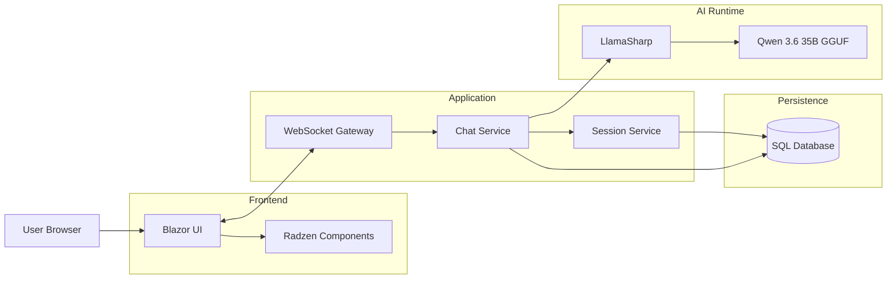
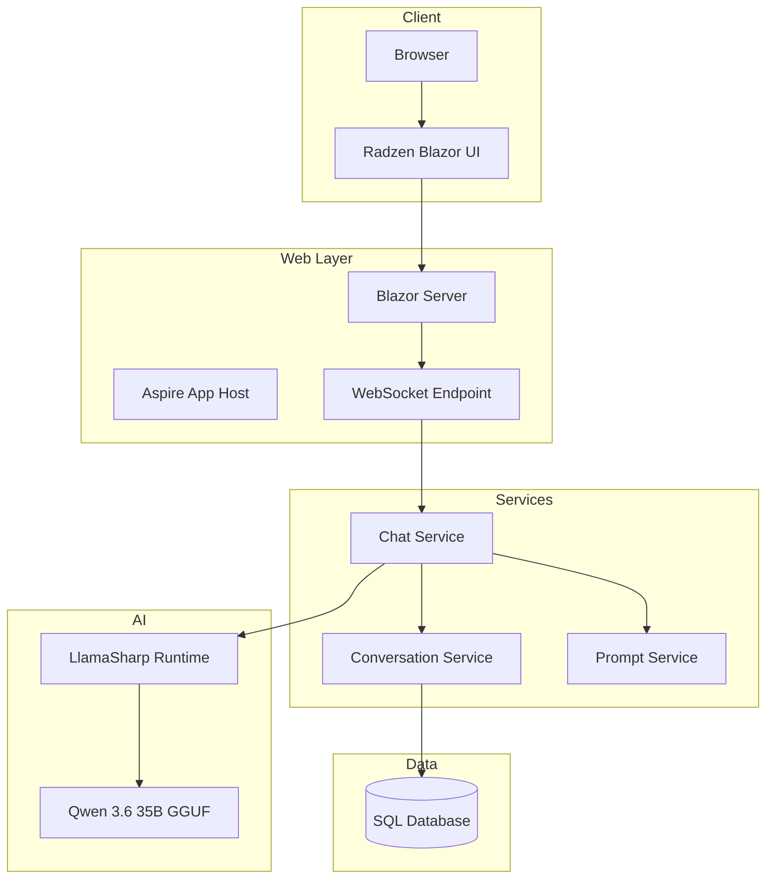
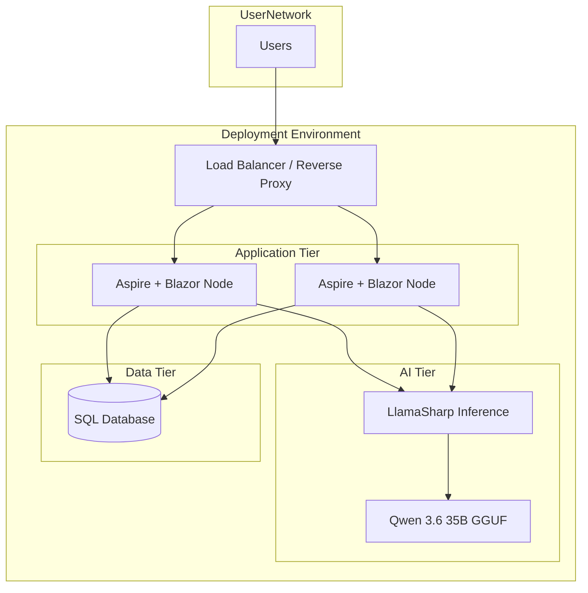
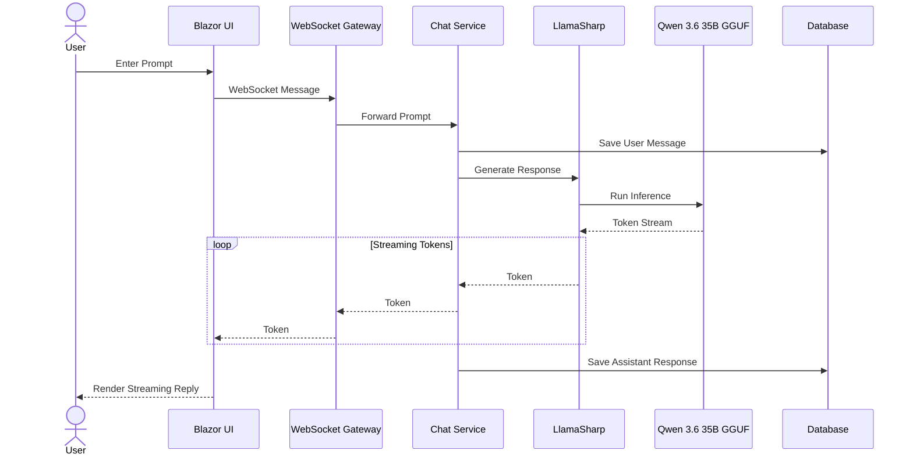
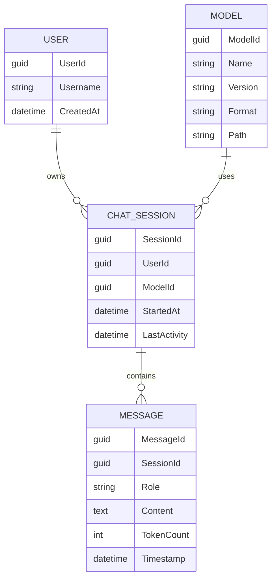
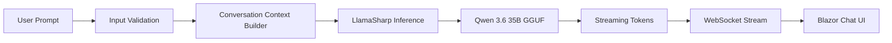

# AI Chat Platform

A cloud-agnostic, enterprise-grade AI chat platform built with:

- Aspire
- Blazor (.NET 10 / C# 14)
- Radzen Blazor UI
- WebSockets
- LlamaSharp
- Qwen 3.6 35B GGUF
- Local GGUF inference
- On-premises and air-gapped deployment support

---

# Overview

The platform provides a real-time conversational AI experience through a Blazor web application. Communication between the browser and server occurs over WebSockets for low-latency streaming responses.

The backend hosts LlamaSharp and loads a local Qwen 3.6 35B GGUF model for inference.

The solution is designed to be:

- Cloud agnostic
- Kubernetes compatible
- VM compatible
- Bare-metal compatible
- Air-gap deployable
- Vendor neutral

---

# High-Level Architecture

---

# Component Architecture

---

# Deployment Architecture

## Cloud Agnostic / Air-Gapped Deployment

### Supported Hosting Models

- Azure
- AWS
- Google Cloud
- OpenShift
- Kubernetes
- Docker Compose
- Virtual Machines
- Bare Metal
- Air-Gapped Secure Networks

---

# Sequence Diagram

## User Chat Interaction

---

# Entity Relationship Diagram (ERD)

---

# Runtime Flow

---

# Technology Stack

| Layer | Technology |
|---------|------------|
| Frontend | Blazor |
| Components | Radzen Blazor |
| Realtime | WebSockets |
| Backend | ASP.NET Core |
| Orchestration | Aspire |
| AI Runtime | LlamaSharp |
| LLM | Qwen 3.6 35B GGUF |
| Database | SQL Server / PostgreSQL |
| Deployment | Docker / Kubernetes / VM / Bare Metal |
| Networking | Reverse Proxy + WebSockets |

---

# Security Considerations

- TLS everywhere
- Optional SSO/OIDC integration
- Role-based access control
- Audit logging
- Air-gapped deployment support
- No dependency on external AI services
- Local model execution
- Local data residency

---

# Non-Functional Requirements

- Horizontal scaling of application nodes
- Streaming token responses
- High concurrency WebSocket connections
- Cloud-neutral deployment
- Air-gapped support
- GPU acceleration
- Local model hosting
- Enterprise observability via Aspire